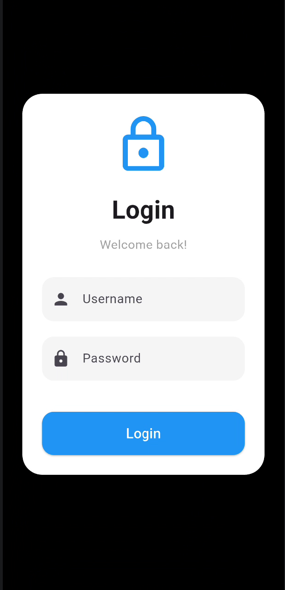
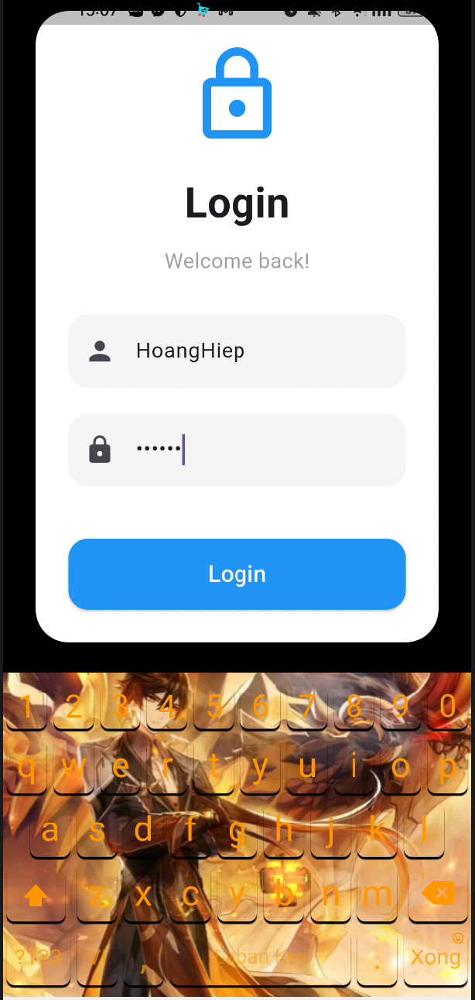
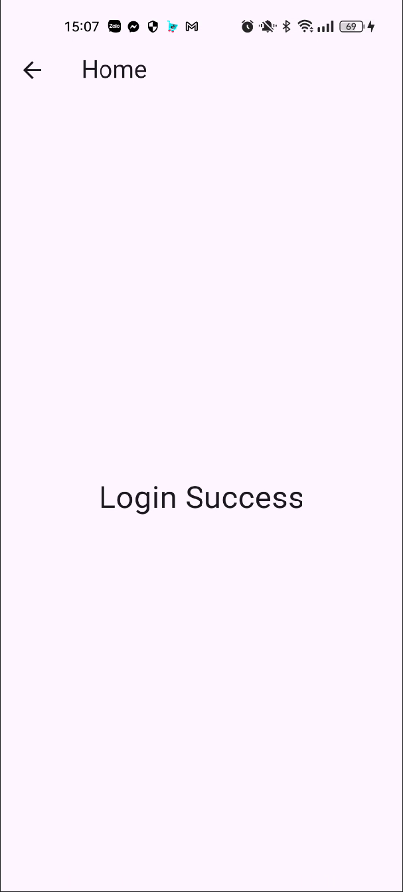

# login_screen
Ứng dụng màn hình đăng nhập đơn giản được xây dựng bằng Flutter với giao diện hiện đại và dễ sử dụng.

## Live code

👉 [Video](https://drive.google.com/drive/folders/1GD2oiD7XJVbe3HPr0FAAWx6z-XBprnXr?usp=sharing)

---

## Tài khoản mặc định

Tên đăng nhập: HoangHiep
Mật khẩu: 123456

## Giao diện

<div align="center">
  <table>
    <tr>
      <td></td>
      <td></td>
      <td></td>
    </tr>
  </table>
</div>

---

## Cách chạy project

```bash
git clone https://github.com/Noname2k4/loginscreen_VuHoangHiep
cd login_screen
flutter run
```
